# A Brief Introduction to the project:
In the fall of 2024, Yehong Qiu led the team in undertaking a deep learning image classification project as part of STA221. This course focuses on the mathematical foundations of machine learning models and encourages students to implement these methods—or explore beyond the classroom teachings—while honing their engineering skills.

Our project aimed to evaluate the statistical reliability of various machine learning models using a standardized rubric, providing a robust comparison framework. 
## Dataset
The dataset used for this project was HAM10000, a dermoscopy image dataset consisting of 10,015 skin cancer images. The objective of the machine learning model was to classify each image into one of seven skin tumor classes:

Actinic keratoses and intraepithelial carcinoma (akiec)
Basal cell carcinoma (bcc)
Benign keratosis-like lesions (bkl)
Dermatofibroma (df)
Melanoma (mel)
Melanocytic nevi (nv)
Vascular lesions (vasc)

  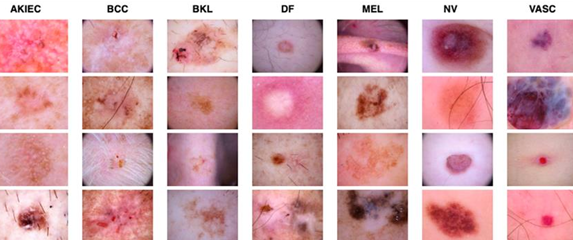

The dataset is an unbalanced dataset in which the number of images under each class varies greatly. 

  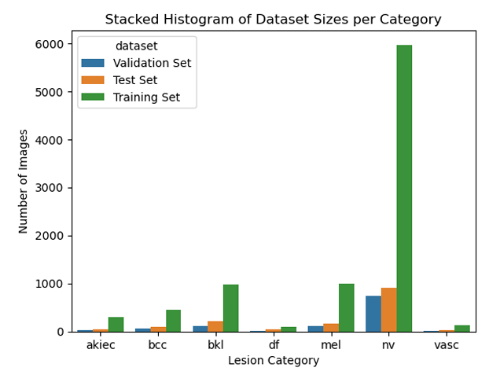

## Main Results:
After training three Machine Learning models (logit regression, Inception V3, FixCaps) on the dataset, we used an additional dataset of 1151 images unseen during training to test the models' capability. 

 

  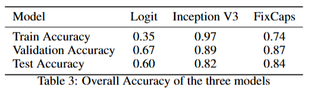

From left to right, up to down, the three tables correspond to the precision, recall and F1 scores within each class of the three models: Logit Regression, Inception V3, and FixCaps, respectively.
 
 

  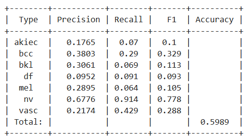
  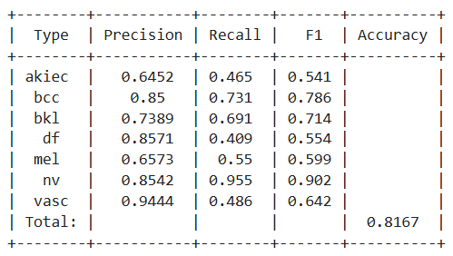
  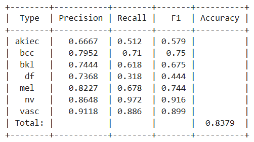

To assess the statistical reliability of the models, we applied a distribution-free statistical inference tool called Conformal Prediction on the three ML models. Specifically we used Randomized Adaptive Prediction Set method (RAPS) to generate conformal scores.

  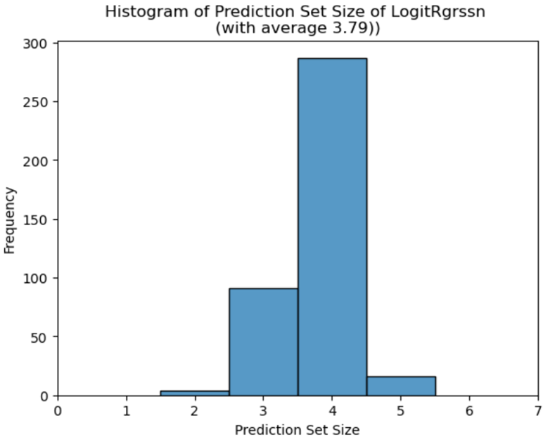
  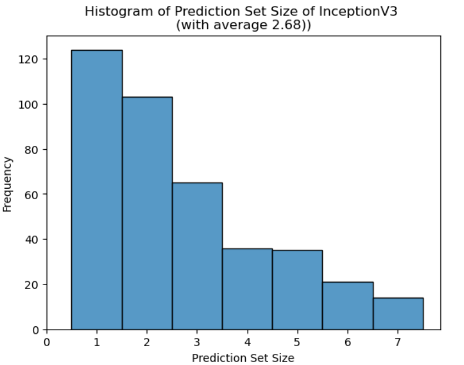
  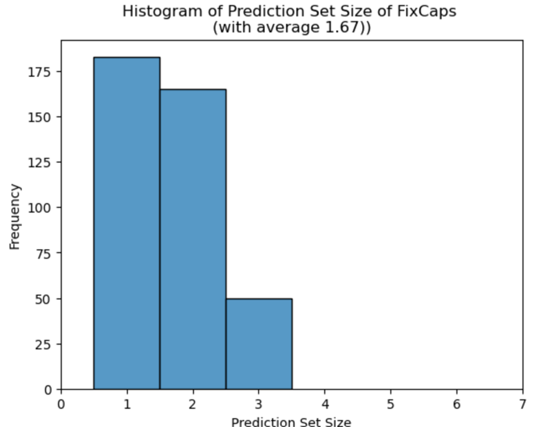

  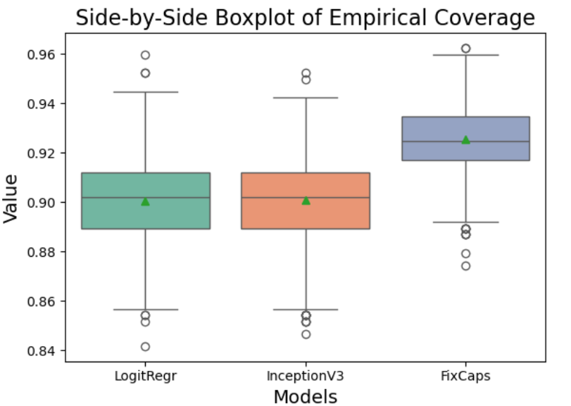
  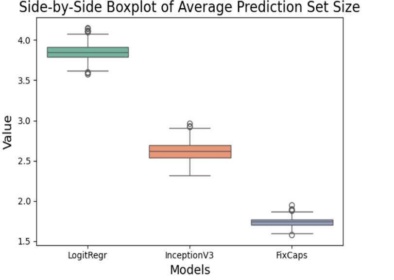

  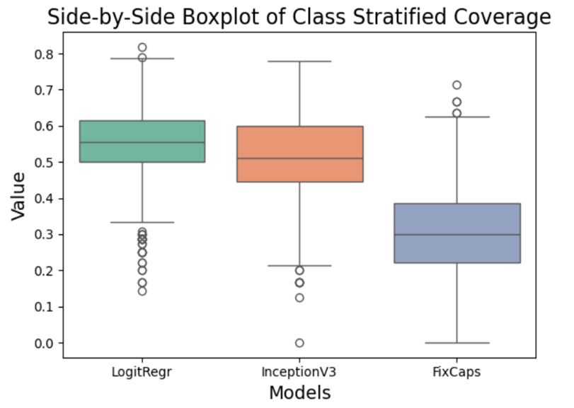
  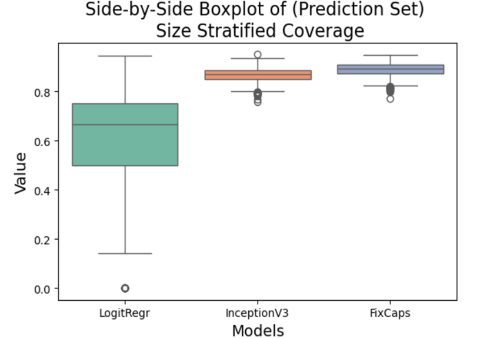

## Main Conclusions:
Under the same confidence level (set at 0.9), larger deep learning models outperform simpler multivariate classifiers, which is logistic regression (a single-layer neural network). The Conformal Prediction procedures for larger models produce smaller average prediction sets, demonstrating their superiority in terms of prediction accuracy. However, the class-stratified coverage boxplot reveals a critical trade-off: larger deep learning models tend to sacrifice underrepresented groups to improve prediction accuracy for the majority groups. Specifically, they overcover more common cancer types while undercovering rare cancer types, leading to diagnostic disparities. While these findings may seem intuitive, they underscore the dual-edged power of black-box-like deep learning models.
## Key Takeaways:
This project provided valuable insights into the strengths and limitations of deep learning models through the lens of Conformal Prediction. Additionally, we gained hands-on experience in:
1. Understanding and leveraging Conformal Prediction as a tool for model evaluation.
2. Building and deploying medium-scale machine learning pipelines (1–10M parameters).
3. Utilizing the new GPU cluster "MSBC" in the UC Davis Statistics Department for computational tasks.
## Acknowledgments:
The team member for the project are: **Yehong Qiu, ChiChun Chen, Savali Sandip Deshmukh, Shivani Sanjay Suryawanshi, and Sriharshini D**
We extend our gratitude to Prof. Ricardo Masini for his insightful lectures and guidance throughout this project. We also thank Michael Berger, Head of AI Insurance at Munich Re, for his inspiring seminar. His discussion on applying Conformal Prediction in designing insurance plans for companies selling black-box AI tools provided valuable industry context. 

Becides, we referenced:
1. https://github.com/Woodman718/FixCaps
2. https://github.com/aangelopoulos/conformal-prediction
to produce our codes. A detailed list of references is in the report.
